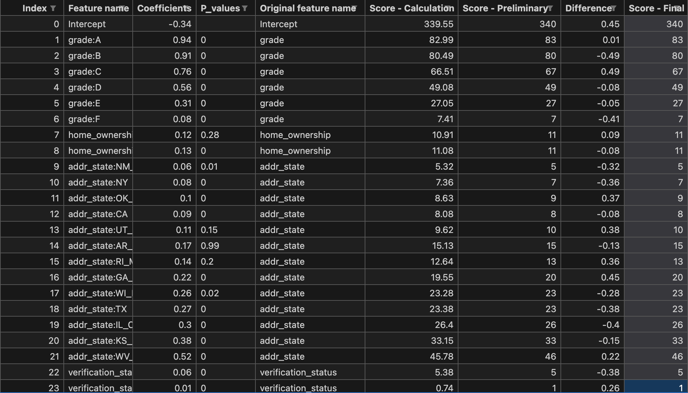

# Credit Risk Modelling
**Info** :This project is to analyze a large loan dataset to create models that predict the chances of borrowers defaulting on their loans (PD), how much money will be lost if they default (LGD), and the total amount at risk (EAD). This includes cleaning the data, applying statistical techniques, and using supervised machine learning to build and validate these models. And also create a scorecard to help make decisions based on the expected loss (EL).
## This repo contain
```
data/ -> loan datasets 
1.) Preprocess.ipynb
2.) Preprocess for PD.ipynb
5.) Preprocess for LGD and EAD.ipynb
model/ -> save and load machine learning model
3.) PD model.ipynb 
4.) PD monitoring.ipynb
6.) LGD model.ipynb
7.) EAD Model.ipynb
8.) Expected Loss.ipynb
```
## Model for Credit Risk
**PD** : *Probability of Default* is the likelihood that your debtor will default on its debts
- Train with logistic regression

**LGD** : *Loss Given Default* is the proportion of total exposure that **cannot** be recovered once a default has occurred
- Two stages approach: Logistic regression and Linear regression

**EAD** : *Exposure at Default* is the total value that a lender is exposed to when the borrower defaults
- Train with linear regression

**EL** : *Expected Loss* is the amount a lender might lose by lending to a borrower


## Scorecard 

